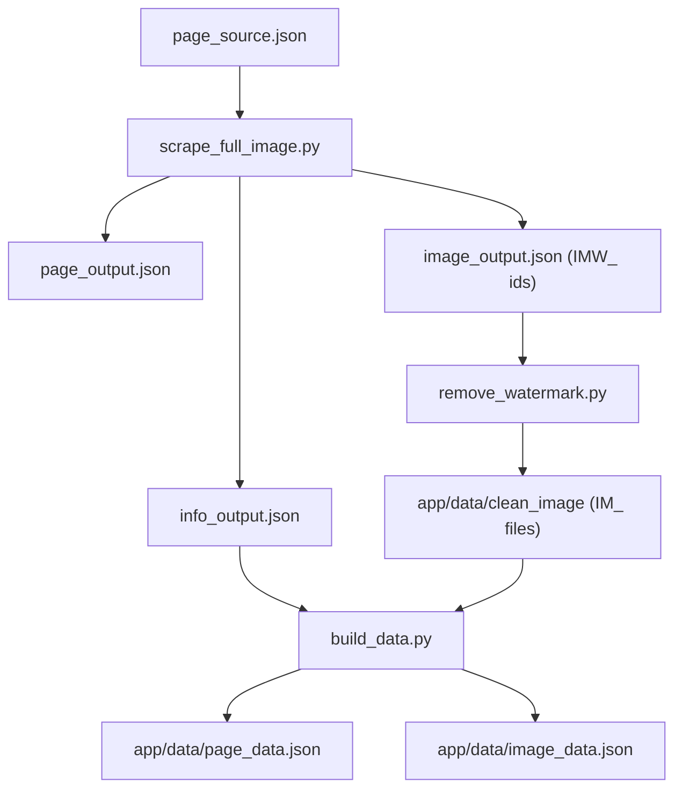

# Data + Image Flow

This file documents the intended end-to-end pipeline for scraping, cleaning, and preparing data for the database.

## Starting Point
- `cleanup_engine/page_source.json`

## Step 1 — Page Scraper (URL/JSON)
Run:
- `python3 cleanup_engine/scrape_full_image.py`

Inputs:
- `cleanup_engine/page_source.json`

Outputs:
- `cleanup_engine/page_output.json` (all data)
- `cleanup_engine/info_output.json` (non-image data)
- `cleanup_engine/image_output.json` (image data; `id` + `url`, with `IMW_` prefix)

## Step 2 — Image Download + Watermark Removal (Images)
Run:
- `python3 cleanup_engine/remove_watermark.py`

Inputs:
- `cleanup_engine/image_output.json`

Process:
- Download each image from `image_output.json`
- Remove watermark
- Save cleaned images with `IM_` prefix

Outputs:
- `app/data/clean_image/IM_<id>.<ext>`

## Step 3 — GitHub Image Sync + Working Folders
Run:
- `git pull --ff-only origin main`

Purpose:
- Keep local image assets aligned with the latest GitHub source of truth before continuing processing.

Image Working Folders:
- `cleanup_engine/watermark/clean_reject/`
  - Images where watermark removal was attempted but result quality is not good.
- `cleanup_engine/watermark/need_work/`
  - Images that still need manual/creator review, saved with creator-attached filename sequence.
- `cleanup_engine/watermark/watermark_images/target/`
  - Scraped source watermark images extracted from the scraping process.

## Step 4 — Data Assembly (Database-Ready)
Run:
- `python3 cleanup_engine/build_data.py`

Inputs:
- `cleanup_engine/info_output.json`
- `app/data/clean_image/`

Outputs:
- `app/data/page_data.json` (mirrors `info_output.json` with UUID)
- `app/data/image_data.json` (references cleaned image files and links to IDs in `page_data.json`)

## Execution Order
1. `cleanup_engine/scrape_full_image.py`
2. `cleanup_engine/remove_watermark.py`
3. `git pull --ff-only origin main`
4. `python3 cleanup_engine/build_data.py`

## End Results
- `app/data/page_data.json`
- Clean images in `app/data/clean_image/`
- `app/data/image_data.json`

## Diagram

